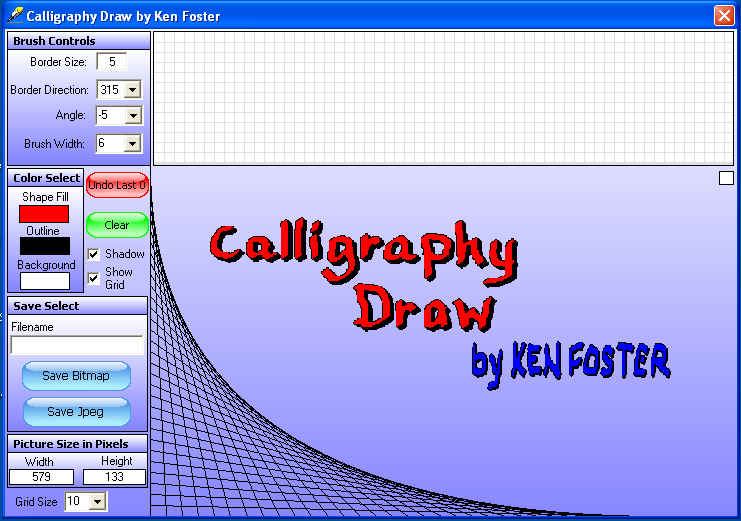

## Calligraphy Draw \(update\)

### Description

The original code is by LaVolpe(Keith). I've just modified and tweaked it to create a freehand drawing program.Keiths code had several advantages,like built in shadow and outline,all done using regions. Hope this is useful to someone. I really liked the outcome.See if you do to. Updated interface a little and a few minor changes.
 
### More Info
 

             |
---                |---
**Submitted On**   |2009-04-30 20:54:18
**By**             |[Kenneth Foster](https://github.com/Planet-Source-Code/PSCIndex/blob/master/ByAuthor/kenneth-foster.md)
**Level**          |Intermediate
**User Rating**    |5.0 (40 globes from 8 users)
**Compatibility**  |VB 6\.0
**Category**       |[Graphics](https://github.com/Planet-Source-Code/PSCIndex/blob/master/ByCategory/graphics__1-46.md)
**World**          |[Visual Basic](https://github.com/Planet-Source-Code/PSCIndex/blob/master/ByWorld/visual-basic.md)
**Archive File**   |[Calligraph2151094302009\.zip](https://github.com/Planet-Source-Code/kenneth-foster-calligraphy-draw-update__1-72036/archive/master.zip)

